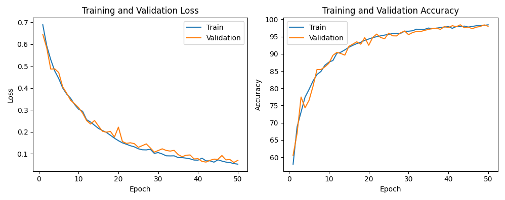

# LockMe
 
Welcome to my software engineering class final project.

The project consists of a file encryption app. 
Login is via face detection, thus make sure you have a camera connected to your PC.

## Usage
### Installation
To activate the system follow these steps:
1. run: `pip install cmake`
2. then run: `pip install -r requirements.txt`
3. use a Unix-based system to rebuild the model from parts in the **_model/model_parts_** directory using the command:`cat model.part* > model.pth`
4. make sure the model name is written with the correct path in the configurations file in the model's directory
5. you are then ready to run: `python main.py`

### running example
#### Terminal UI view:

#### Tkinter based GUI view:

### Dataset:
* The **dataset** is a combination of samples I transformed from AT&T, LFW and my own images.
* I used 3 functions to augment the images:
  1. horizontal flip
  2. brightening
  3. darkening
* To recreate a similar dataset use the functions in the **model/dataset.py** file.
#### Labels definition:
* `1` - for samples of different subjects
* `0` - for samples of the same subject
#### examples:
1. image pairs: 
labels: `[0. 1. 0. 0. 1. 0. 0. 1.]`

2. image pairs: 
labels: `[0. 0. 0. 1. 0. 0. 1. 1.]`

## The Model
* I used the classic SNN architecture using binary cross entropy loss.
* I tried a few models and loss functions such as triplet loss and contrastive loss with different learning rates 
but BCE gave me the best results with the amount of data that I had.
* The model is trained for 50 epochs and learning rate of 0.0006 using batch size 128.

Here below is the loss and accuracy of the model after 50 epochs:

### - WIP -
